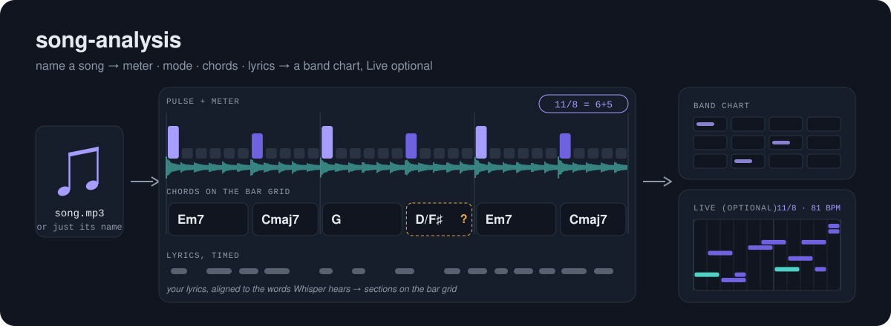
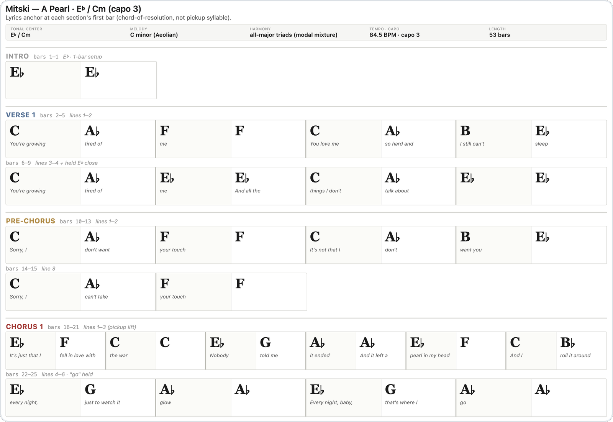
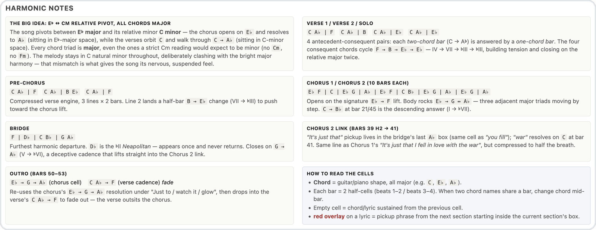

# song-analysis

**Claude Code skills that turn a song into a band chart — chords, lyrics and commentary —
including the odd meters, modes and drones that other analysis tools flatten into 4/4
major/minor. No DAW needed; Ableton Live is an optional extra.**

- **Just name a song** — "analyze *Talk It Over* by Leon Bridges" — and Claude finds the
  recording, checks the pick with you, and analyzes it.
- **Or hand it an mp3** and the lyrics.
- It finds the pulse, sweeps for the meter, separates stems, transcribes the bass, names
  the mode, reads the chords and times the lyrics.
- It writes a **chart a band can play from**: chords, lyrics, song map and commentary.
- Runs offline on an Apple Silicon Mac; every step is a script with tests.

## The skills

No DAW needed:

| Skill | Use when |
|---|---|
| **`song-analysis`** | A song (a file, or just its name) has to become tempo, meter, key/mode, stems, bass line, chords per bar, timed lyrics, sections, or a band chart |
| `bass-transcribe` | You played bass (or sang a line) and want it as MIDI, a Live clip or a tab |

Optional — only if you use **Ableton Live** (11/12, with the AbletonMCP server):

| Skill | Use when |
|---|---|
| `song-to-ableton` | You want a song rebuilt, covered or reinterpreted in Live — analysis feeding the build |
| `ableton-mcp` | Driving Live over MCP: tracks, clips, notes, devices, mixing, time signature — and the gotchas |
| `ableton-arrangement` | Arranging in Live: sections, bass and drum patterns in any meter, FX chains, dynamics |
| `ableton-song-remix` | Remix or sketch an analysed song in Live: the original vocal warped onto Live's bar grid, new drums, bass and keys on the chart's chords, in the song's meter |



## Why it's different

- **It finds meters it was never told about.** Instead of choosing between 3/4 and 4/4, it
  sweeps every cycle from 2 to 25 pulses on the drum, bass and harmonic stems. 7/8, 11/8
  and 5/4 come back with their grouping — 11/8 as 6+5, beat 1 counted from the kick.
- **It asks instead of guessing.** When the evidence can't decide — two equally strong
  accents, a 2-bar phrase that could be one bar, an eighth-note pulse that doubles the DAW
  tempo — it stops and tells Claude exactly what to ask you.
- **It measures modes.** Tonic from what the bass sustains, mode from bar-by-bar duels of
  the characteristic degrees (♯4 for Lydian, ♭7 for Mixolydian, ♭2 for Phrygian…). A degree
  that never sounds is reported as undetermined, not filled in.
- **It shows its uncertainty.** The chart says where the meter and mode came from and marks
  each chord cell whose own evidence names another root (lv-chordia, or the triad
  cross-check backed by the bass), so your listening pass goes where it's needed.
- **It's benchmarked, failures included.** A local benchmark scores every step against
  player-verified answers; the docs record what didn't work, with numbers.

See [how it compares](docs/COMPARISON.md) with 75 other tools, skills and papers.

## What it looks like

A chart it made (Mitski, "A Pearl") — chords per half-bar, bass notes in blue, lyrics where
they're sung, sections in colour:



Further down the same page, the analysis — harmonic notes in scale degrees, the arrangement,
and the open questions for the player:



The meter sweep on a song in 11/8:

```text
CONSENSUS: 11 pulses per cycle (3/3 bands agree)
  downbeat: pulse 6 of the grid (kick band); grouping 5+6 (accents)
  AMBIGUOUS: the two strongest kick accents are within 10% - beat 1 may
    be pulse 0 instead, giving 6+5. Ask the user which hit is '1'.
  confidence HIGH: 5.4x clear of unrelated periods.
```

Claude asks which kick is "1" and whether the pulse is an eighth, then:

```text
11/8 as 6+5, 32 bars from 0.00s (0 pickup pulses); bar tempo 157.89-162.16 (drift 2.6%); Live tempo 81.08
```

And the mode of the same song, where a key detector said "G♯ minor":

```text
tonic E (57% of bass time) -> lydian
  third    wins  32 : 0   -> a
  4_vs_#4  wins   0 : 32  -> b
  7_vs_b7  wins  32 : 0   -> a
```

## Quick start

```bash
git clone https://github.com/PerIPan/song-analysis.git
cd song-analysis
for s in song-analysis bass-transcribe; do ln -sfn "$PWD/$s" ~/.claude/skills/$s; done
# optional, Ableton Live users only:
for s in song-to-ableton ableton-mcp ableton-arrangement ableton-song-remix; do ln -sfn "$PWD/$s" ~/.claude/skills/$s; done
```

Set up the Python environments once —
[`song-analysis/references/environment-setup.md`](song-analysis/references/environment-setup.md)
has the exact, pinned commands. Restart Claude Code and ask:

> Analyze "Talk It Over" by Leon Bridges and make a chord chart for my band.

or, with your own file: *Analyze song.mp3 and make a chord chart for my band. Lyrics are in
lyrics.txt.*

## Just name a song

No file needed. Claude searches YouTube Music first, where the record labels' own uploads
are, then YouTube. It skips uploads titled as live takes, covers, karaoke, remixes or
sped-up edits, and shows you its pick — title, channel, length, album and year — before
downloading anything. Once you confirm, the audio goes into the song folder as a WAV, with a
`source.json` the chart's provenance line cites, and the analysis runs as usual. Give it the
length of a copy you have and it picks that cut. In 17 test searches (September 2026: rock,
jazz, soul, indie pop, and Greek songs typed in either alphabet) the pick was the label's
own upload every time.

It needs the optional yt-dlp venv ([setup](song-analysis/references/environment-setup.md)).
Fetch only recordings you have the right to study: YouTube's Terms restrict downloading.
No logins; nothing is uploaded.

## Optional: Ableton Live

Not needed for the chart. If you use Live, `song-to-ableton` rebuilds the analysed song in
Live with the right tempo and time signature (chords, bass, drum logic, sections), driving
it through the AbletonMCP server —
[`ableton-mcp/references/setup-install.md`](ableton-mcp/references/setup-install.md).

When the chart is done and Live is connected, Claude offers a **sketch** or a **remix**
(`ableton-song-remix`): the original vocal is loaded into Live and warped with one marker
per downbeat, so Live's bars are the song's bars at any tempo, and new drums, bass and keys
are written on the chart's chords in the song's own meter (an 11/8 song grouped 6+5 gets a
6+5 groove) — presets `house`, `synth-pop`, `lo-fi`, `garage-punk`, or `as-analysed` for a
sketch with the original mix muted for A/B. Every drum part passes a drummer-playability
check. It needs a small patch to the AbletonMCP Remote Script (audio-file loading and
working warp markers), shipped as a `git apply` patch —
[`ableton-mcp/references/remote-script-patch.md`](ableton-mcp/references/remote-script-patch.md).

## The pipeline

| Phase | Script | Produces |
|---|---|---|
| 0 Audio (optional) | `fetch_audio.py` (yt-dlp) | the song as WAV + `source.json`, from its name |
| 1 Pulse + key | `foundation.py pulse` | beat grid, tempo-octave check, key (top two) |
| 2 Stems | demucs `htdemucs_ft` | bass, drums, vocals, other |
| 3 Meter | `detect_meter.py` → `foundation.py meter` | cycle, grouping, downbeats, bar tempo, drift |
| 4 Bass, tonic, mode | `bass_notes.py` → `mode_test.py` | bass MIDI, tonic, mode (per section) |
| 5 Lyrics | `whisper_gated.py` | word timings (Whisper, gated by the vocal stem) |
| 6 Sections | `align_lyrics.py` | your lyrics with times, sections on the bar grid |
| 7 Chords | `lv_chords.py` + `chord_proposal.py` | chords with 7ths/inversions, cross-checked per cell |
| 8 Chart | `stem_activity.py` → `chart_html.py` (renders a per-song data file Claude writes) | self-contained HTML chart: chords + lyrics, song map, commentary |

`validate_artifacts.py` checks the hand-offs between phases;
`ableton-mcp/scripts/push_notes.py` pushes notes into Live over its TCP socket.

## Measured

On a local benchmark of player-verified songs and public lyric data (small samples —
details in [COMPARISON.md](docs/COMPARISON.md#measured-numbers-local-benchmark)):

- meter consistent with the true bar on 3 of 4 songs, none wrong (1 inconclusive)
- a verified Lydian drone named E Lydian, ♯4 in 32 of 32 bars
- chords 73–96% major/minor agreement per song
- lyrics 17.9% word error; 83% of line starts within 1 s; 98% of sections within 2 s

Run it yourself with `song-analysis/bench/run_bench.py` against your own verified songs
(truth files stay on your machine).

## Requirements

- Apple Silicon Mac (tested on a base M3, 16 GB); CUDA works for stems
- [uv](https://docs.astral.sh/uv/) and ffmpeg
- Python 3.12 virtualenvs on current releases — NumPy 2.5, librosa 1.0, madmom (latest),
  TensorFlow 2.21, demucs 4.1, torch 2.14, lv-chordia 1.1, mlx-whisper 0.4 — about 2 GB of
  models; exact pins in the environment reference
- Optional, to fetch a song by name: yt-dlp (its own venv, kept current) and deno ≥ 2.3 or node ≥ 22
- Optional, for the Live skills only: Ableton Live 11/12 and the AbletonMCP Remote Script
  (`ableton-song-remix`: Live 12 and the patched Remote Script)

## Tests

Offline, on synthetic audio, a stand-in yt-dlp or a mock Live socket — 605 checks:

```bash
<analysis-venv>/bin/python song-analysis/tests/test_detect_meter.py
<analysis-venv>/bin/python song-analysis/tests/test_chord_proposal.py
<analysis-venv>/bin/python song-analysis/tests/test_mode_test.py
<analysis-venv>/bin/python song-analysis/tests/test_downbeat_check.py
<analysis-venv>/bin/python song-analysis/tests/test_stem_activity.py
<analysis-venv>/bin/python song-analysis/tests/test_performance.py
python3 song-analysis/tests/test_foundation.py
python3 song-analysis/tests/test_align_lyrics.py
python3 song-analysis/tests/test_chart_html.py
python3 song-analysis/tests/test_lyrics_tab.py
python3 song-analysis/tests/test_fetch_audio.py
<whisper-venv>/bin/python song-analysis/tests/test_whisper_artefacts.py
python3 ableton-mcp/tests/test_push_notes.py
python3 ableton-song-remix/tests/test_chordsym.py
python3 ableton-song-remix/tests/test_remix_plan.py
python3 ableton-song-remix/tests/test_remix_parts.py
python3 ableton-song-remix/tests/test_remix_build.py
```

## Layout

Each skill is a `SKILL.md` (when to use it, the method, the traps) plus `references/`
loaded on demand, `scripts/` it runs and `tests/` for those scripts. Machine-specific paths
live in one "This machine" section of the environment reference.

## Licence

MIT — see [LICENSE](LICENSE). The tools the skills call keep their own licences — several
models (madmom's, ADTOF, some separators) are non-commercial; they are installed, never
copied into this repo.
